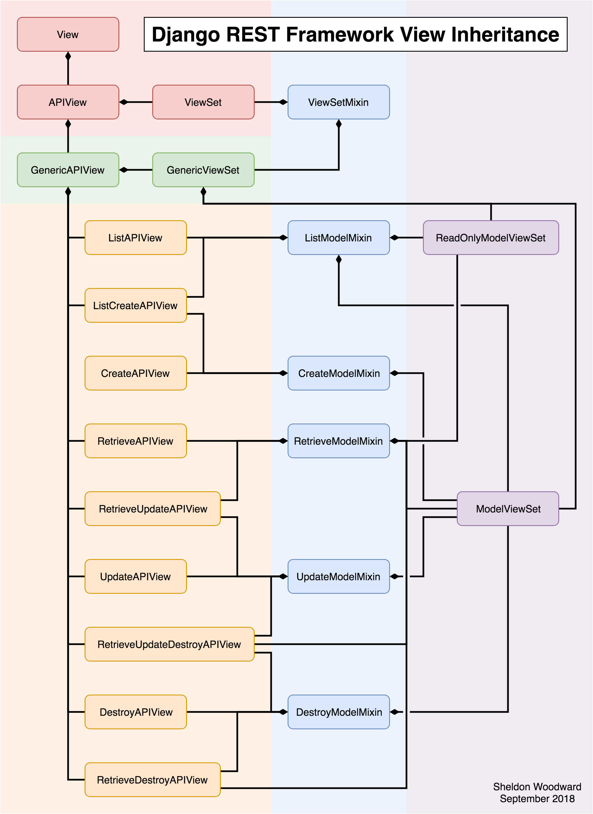

# Serializer & View & Router
> https://kknews.cc/code/xgyy82q.html

## Serializer
1. serializers.Serializer
```python:
class LiveInfoSerializer(serializers.Serializer):
    id = serializers.IntegerField(read_only=True) 
    live_id = serializers.IntegerField()
    live_streamer = serializers.CharField(max_length=20, required=False)
    live_title = serializers.CharField(max_length=30)
    live_pop = serializers.IntegerField(default=0, required=False)
    live_content = serializers.CharField(default='未設定', max_length=20, required=False)
    is_delete = serializers.BooleanField(default=False, required=False)
```
- write_only：True, Deserialization
- read_only：True, Serialization
- required：True, Deserialization
- default：default value
- max_length & min_length：max and min length
- max_value & min_value：max and min number

2. Serializer - Sub List
> https://www.django-rest-framework.org/api-guide/relations/#serializer-relations
   1. PrimaryKeyRelateField (Get the PK only)
    ```python:
    Ltype = serializers.PrimaryKeyRelatedField(queryset=LiveInfo.objects.all())
    ```
    - Example
        ```python:
        from django.contrib.auth.models import User

        class UserSerializer(serializers.ModelSerializer):
            snippets = serializers.PrimaryKeyRelatedField(many=True, queryset=Snippet.objects.all())

            class Meta:
                model = User
                fields = ['id', 'username', 'snippets']
        ```

   2. Serializer in Serializer (Best) (Get what you want)
    ```python:
    Ltype = LiveInfoSerializer()
    ```
   3. Get sub return \_\_str\_\_
    ```python:
    Ltype = serializers.StringRelatedField(many=True)
    ```

3. Serializer's Validation (validate__field_name)

4. serializer.ModelSerializer (If target of serializer is a model)
   - Base on model field, auto generate the serializer/validation field
   - Provide default create() and update()
    ```python:
    class LiveInfoSerializer(serializers.ModelSerializer): 
        class Meta: model = LiveInfo 
        fields = '__all__' 
        # fields = ('id', 'title', ...)

        # exclude some field 
        exclude = ['is_delete'] 
        
        # extra field
        extra_kwargs = { 
            # 'live_title': {'validators': [live_name]},
            'live_streamer': {'required': False},
            'live_pop': {'min_value': 0, 'required': False}, 
            }
    ```

## Views
1. Level 1 (not use serializer)
- Class View
- Access Database
- JsonResponse (serializer)
 ```python:
 class LiveListView(View): 
     def get(self, request):

        lives = LiveInfo.objects.all() 
        lives_list = [] 

        for live in lives: 
            lives_list.append({ 
                'live_id': live.live_id,
                'live_streamer': live.live_streamer,
                'live_title': live.live_title,
                'live_pop': live.live_pop,
                'live_content': live.live_content
                })

        return JsonResponse(lives_list, safe=False)

```

2. Level 2 (use serializer)
```python:
class LiveDetailView(View): 
    def get(self, request, pk): 
        try: 
            live = LiveInfo.objects.get(pk=pk) 
        except LiveInfo.DoesNotExist: 
            return HttpResponse(status=404)

        serializer = LiveInfoSerializer(live)

        return JsonResponse(serializer.data)  # dict

class LiveListView(View): 
    def get(self, request): 
        lives = LiveInfo.objects.all() 
        serializer = LiveInfoSerializer(lives, many=True)  # Multiple
        return JsonResponse(serializer.data, safe=False)
```

3. APIView
   - request.data (for post, e.g. request.data.get('key'))
   - request.query_params (for get, e.g. request.query_params.get('key'))
   - Response Object (base on Accept of Header from client, it will tell server which are client able to read) (e.g. return Response(result, status=status.HTTP_200_OK))
   - Handle Exception (return to client)
   - Auth / Permission / Throttle

4. GenericAPIView, extend APIView
   - Extend APIView
   - Add Handle Serializer (serializer_class, get_serializer_class, get_serializer)
   - Add Handle Model Query (get_queryset, get_object)
   - Filtering and Pagination

5. 5 type Mixin
   1. ListModelMixin
   2. CreateModelMixin
   3. RetrieveModelMixin
   4. UpdateModelMixin
   5. DestroyModelMixin

6. 9 type Sub APIView, extend GenericAPIView and related Mixin
   1. ListAPIView
   2. CreateAPIView
   3. RetrieveAPIView
   4. UpdateAPIView
   5. DestroyAPIView
   6. ListCreateAPIView
   7. RetrieveUpdateAPIView
   8. RetrieveDestroyAPIView
   9. RetrieveUpdateDestroyAPIView

7. ViewSet
   1. GenericViewSet
   2. ModelViewSet
   3. ReadOnlyModelViewSet


## Router
> https://www.django-rest-framework.org/api-guide/routers/
1. Simple Router
2. Default Router

The difference between DefaultRouter and SimpleRouter generates an additional root path (/) configuration item, and each configuration item address can follow .json and return json data directly.

```python:
from rest_framework.routers 
import DefaultRouter 
from livetest import views 

urlpatterns = []

router = DefaultRouter() 
router.register('lives', views.LiveInfoView, base_name='live')

urlpatterns += router.urls
```

## Other Function
The DRF framework has other functions: authentication, permissions, current limiting, filtering, sorting, paging, and exception handling mechanisms.

## DRF View Architecture
<kbd>

</kbd>